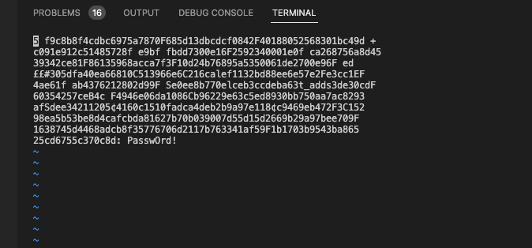
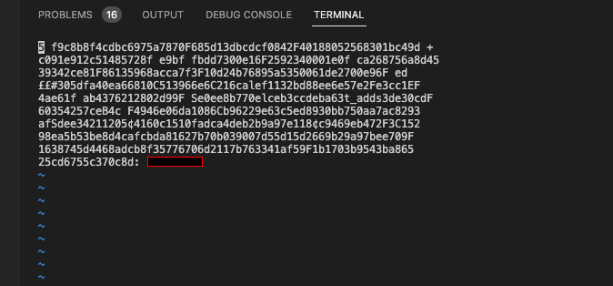

# sanipass

Sanipass is a tool that takes in a list of sensitive information and attempts to sanitize screenshots containing that information for reports and other public consumption. The sanitized screenshots will be saved alongside the original screenshot with a `-sanitized` suffix.

**Before**



**After**



## Install

Sanipass can be installed by cloning this repository and running pip3 install . and subsequently executed from PATH with sanipass.
Please ensure that the pre-requisites are also installed before attempting to run sanipass.

### Pre-requisites
- Tesseract

#### Installing Tesseract

##### MacOS

```bash
brew install tesseract
```

##### Debian (Untested)

```bash
sudo apt install tesseract-ocr -y
```

## Usage

```bash
git clone https://github.com/coffeegist/sanipass
cd sanipass
poetry install
poetry run sanipass -s my-password-list.txt -i report-images/
```

## Examples

## Development
sanipass uses Poetry to manage dependencies. Install from source and setup for development with:
```
git clone https://github.com/coffeegist/sanipass
cd sanipass
poetry install
poetry run sanipass --help
```

## Credits
